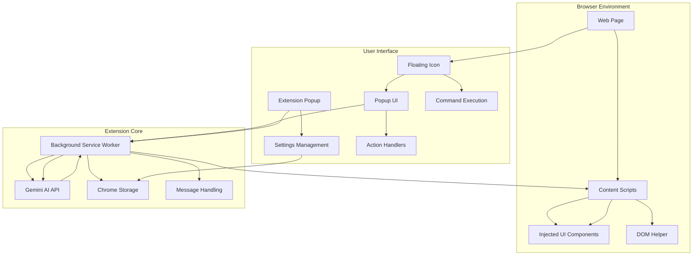
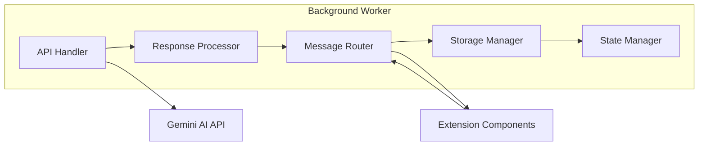
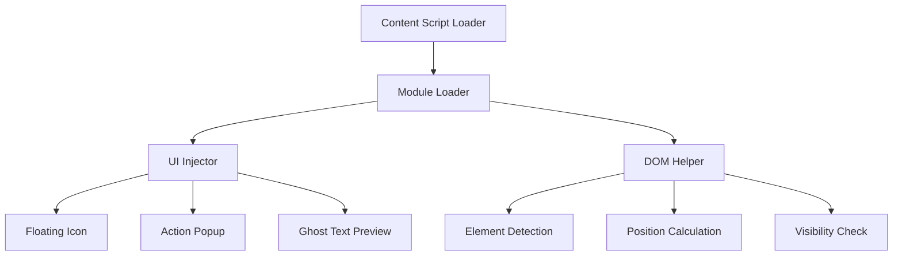
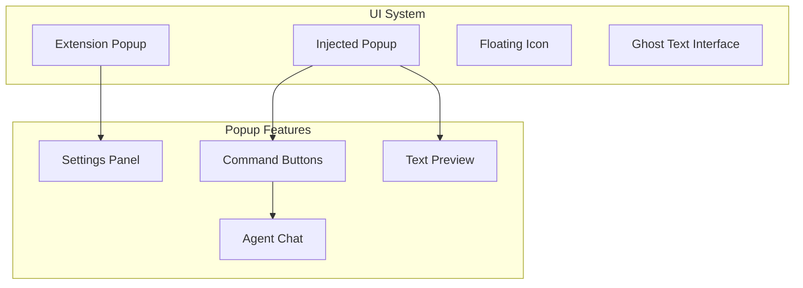
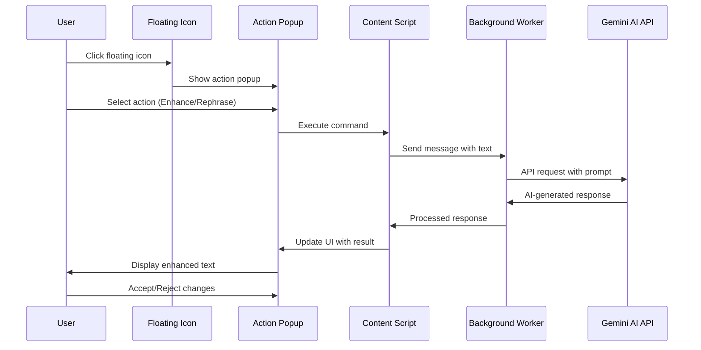
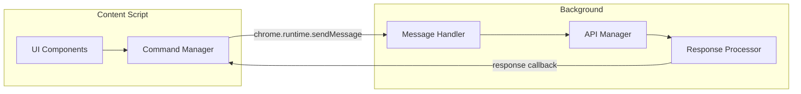

# Promen - AI Prompt Assistant

[](https://github.com/sbeeredd04/promen)
[](LICENSE)
[](https://chrome.google.com/webstore)

Promen is a powerful Chrome extension that revolutionizes how you interact with AI tools across the web. It provides intelligent prompt enhancement, real-time suggestions, and seamless integration with text fields on any website, empowering you to craft more effective prompts and unlock the full potential of AI assistance.

## 🎯 Vision & Purpose

In the rapidly evolving AI landscape, the quality of your prompts directly determines the quality of AI responses. Promen bridges this gap by providing sophisticated prompt engineering capabilities directly in your browser, making advanced AI interaction accessible to everyone.

## ✨ Features

### Core Functionality
- **🎪 Smart Detection**: Automatically identifies text fields and provides contextual assistance
- **🔧 Enhance Prompts**: Expands and enriches your prompts with additional context and specificity
- **🔄 Rephrase Prompts**: Rewrites prompts for better clarity, conciseness, and effectiveness
- **🤖 AI Agent**: Interactive assistant for complex prompt engineering tasks
- **⌨️ Keyboard Shortcuts**: Quick access with customizable hotkeys
- **🎨 Glassmorphism UI**: Modern, elegant interface that integrates seamlessly

### Advanced Features
- **Code Preservation**: Intelligent handling of code blocks and technical content
- **Multi-format Support**: Works with various text input types and rich text editors
- **Context Awareness**: Adapts suggestions based on the type of content being created
- **Real-time Processing**: Instant feedback and suggestions as you type

## 🏗️ Architecture Overview

Promen follows a modular Chrome Extension architecture built on Manifest V3, ensuring security, performance, and future compatibility.



## 🔧 Technical Stack

### Frontend Technologies
- **JavaScript ES6+**: Modern JavaScript with module system
- **HTML5**: Semantic markup for extension interfaces
- **CSS3**: Advanced styling with glassmorphism design
- **Material Icons**: Consistent iconography
- **Ubuntu Mono Font**: Enhanced readability for code content

### Chrome Extension APIs
- **Manifest V3**: Latest extension platform for enhanced security
- **Content Scripts**: Dynamic injection and DOM manipulation
- **Background Service Worker**: Event-driven background processing
- **Storage API**: Persistent configuration and state management
- **Tabs API**: Cross-tab functionality and navigation
- **Scripting API**: Dynamic script injection

### AI Integration
- **Google Gemini AI**: Advanced language model (gemini-2.0-flash)
- **REST API**: RESTful communication with AI services
- **Streaming Responses**: Real-time AI response processing
- **Error Handling**: Robust error management and fallbacks

### Development Tools
- **ES6 Modules**: Modular code organization
- **Debug Configuration**: Comprehensive logging and debugging
- **Chrome DevTools**: Native debugging support

## 🏛️ Component Architecture

### 1. Background Service Worker
The heart of the extension, responsible for:
- AI API communication
- Cross-component message routing
- State management and persistence
- Response processing and formatting



### 2. Content Script System
Handles webpage interaction and UI injection:



### 3. User Interface Components



## 🔄 Data Flow Architecture

### Request-Response Cycle



### Message Passing System



## 📁 Project Structure

```
promen/
├── manifest.json                 # Extension configuration
├── icons/                       # Extension icons
│   └── icon16.png
├── src/
│   ├── background/              # Background service worker
│   │   ├── background.js        # Main background script
│   │   └── service-worker.js    # Service worker setup
│   ├── content-scripts/         # Content script system
│   │   ├── content-script-loader.js  # Module loader
│   │   ├── inject-ui.js         # UI injection logic
│   │   └── inject-ui.css        # Injected UI styles
│   ├── extension-popup/         # Extension popup interface
│   │   ├── extension-popup.html
│   │   ├── extension-popup.css
│   │   └── extension-popup.js
│   ├── popup/                   # Action popup components
│   │   ├── popup.html
│   │   ├── popup.css
│   │   └── popup.js
│   └── utils/                   # Utility modules
│       ├── debug-config.js      # Debug configuration
│       └── dom-helper.js        # DOM manipulation helpers
├── styles/                      # Global styles
│   ├── theme.css               # Main theme
│   ├── autocomplete.css        # Autocomplete styling
│   └── bg.png                  # Background assets
└── README.md                   # This file
```

## 🚀 Getting Started

### Prerequisites
- Chrome browser (v88+)
- Google Gemini API key
- Developer mode enabled in Chrome

### Installation

1. **Clone the repository**
   ```bash
   git clone https://github.com/sbeeredd04/promen.git
   cd promen
   ```

2. **Load the extension**
   - Open Chrome and navigate to `chrome://extensions/`
   - Enable "Developer mode"
   - Click "Load unpacked" and select the `promen` directory

3. **Configure API Key**
   - Click the Promen extension icon
   - Go to Settings
   - Enter your Google Gemini API key
   - Save the configuration

### Development Setup

1. **Enable Debug Mode**
   ```javascript
   // In src/utils/debug-config.js
   export const DEBUG = true;
   ```

2. **Monitor Console**
   - Open Chrome DevTools
   - Check console for debug messages prefixed with `[Promen Debug]`

3. **Hot Reload**
   - Make changes to source files
   - Visit `chrome://extensions/`
   - Click the refresh icon for Promen

## 🎮 Usage Guide

### Basic Operations

1. **Automatic Detection**
   - Navigate to any webpage with text inputs
   - Look for the floating Promen icon near text fields
   - Click the icon to access features

2. **Enhance Prompts**
   - Select text or place cursor in text field
   - Press `Alt+E` or click "Enhance" in popup
   - Review the enhanced version
   - Accept or reject the changes

3. **Rephrase Content**
   - Select text to rephrase
   - Press `Alt+R` or click "Rephrase" in popup
   - Compare original and rephrased versions
   - Apply changes as needed

4. **Agent Interaction**
   - Press `Alt+A` or click "Agent" in popup
   - Engage in conversational prompt engineering
   - Get contextual suggestions and improvements

### Keyboard Shortcuts

| Action | Windows/Linux | macOS |
|--------|---------------|-------|
| Open Extension | `Ctrl+Shift+P` | `Cmd+Shift+P` |
| Enhance Prompt | `Alt+E` | `Alt+E` |
| Rephrase Text | `Alt+R` | `Alt+R` |
| Agent Chat | `Alt+A` | `Alt+A` |

## 🔧 Configuration

### API Configuration
Navigate to the extension popup → Settings to configure:
- **Gemini API Key**: Your Google AI API key
- **Debug Mode**: Enable/disable debug logging
- **Extension State**: Enable/disable the extension

### Supported Platforms
- Google Docs
- Gmail
- Notion
- Discord
- Slack
- ChatGPT
- Claude
- Any webpage with text inputs

## 🛡️ Security & Privacy

### Data Handling
- **Local Storage**: API keys stored locally using Chrome Storage API
- **No Data Collection**: No user data is collected or transmitted to third parties
- **Secure API Communication**: All AI requests use HTTPS encryption
- **Minimal Permissions**: Only requests necessary permissions for functionality

### Permissions Explained
- `activeTab`: Access current tab for content script injection
- `scripting`: Dynamic script injection for UI components
- `storage`: Local storage for API keys and settings
- `tabs`: Tab management for external links
- `<all_urls>`: Universal text field detection (no data access)

## 🔍 Debugging & Troubleshooting

### Debug Mode
Enable debug mode for detailed logging:
```javascript
// src/utils/debug-config.js
export const DEBUG = true;
```

### Common Issues

1. **Icon Not Appearing**
   - Check if debug mode is enabled
   - Verify the text field is detected: `window.__promenDebug.getDetectedElements()`
   - Ensure content scripts are loaded

2. **API Errors**
   - Verify API key is correctly set
   - Check network connectivity
   - Review console for error messages

3. **UI Not Responding**
   - Refresh the page
   - Disable and re-enable the extension
   - Check for JavaScript errors in console

### Debug Commands
Access debug utilities in browser console:
```javascript
// Check detected elements
window.__promenDebug.getDetectedElements()

// View current state
window.__promenDebug.getState()

// Test icon positioning
window.__promenDebug.testIconPositioning()
```

## 🤝 Contributing

We welcome contributions! Please see our contributing guidelines:

### Development Workflow
1. Fork the repository
2. Create a feature branch
3. Make your changes
4. Test thoroughly
5. Submit a pull request

### Code Standards
- Use ES6+ JavaScript
- Follow existing code style
- Include debug logging for new features
- Update documentation for API changes

### Testing
- Test on multiple websites
- Verify keyboard shortcuts work
- Check error handling paths
- Validate UI responsiveness

## 📋 Roadmap

### Current Version (1.0.0)
- ✅ Basic prompt enhancement
- ✅ Text rephrasing
- ✅ Floating icon UI
- ✅ Keyboard shortcuts

### Upcoming Features
- 🔄 Advanced agent interactions
- 🔄 Custom prompt templates
- 🔄 Multi-language support
- 🔄 Collaborative prompt sharing
- 🔄 Integration with more AI models

## 📞 Support

### Resources
- **Website**: [prom10.vercel.app](https://prom10.vercel.app/)
- **Bug Reports**: [Google Form](https://forms.gle/L5Xd8z1ugnpvr6Zz8)
- **Documentation**: This README and inline code comments

### Getting Help
1. Check the troubleshooting section above
2. Enable debug mode and check console logs
3. Submit detailed bug reports with reproduction steps
4. Include browser version and extension version in reports

## 📄 License

This project is licensed under the MIT License - see the [LICENSE](LICENSE) file for details.

## 🙏 Acknowledgments

- Google Gemini AI for powerful language model integration
- Chrome Extensions team for the robust platform
- Material Design for iconography
- Open source community for inspiration and tools

---

**Made with ❤️ for better AI interaction**